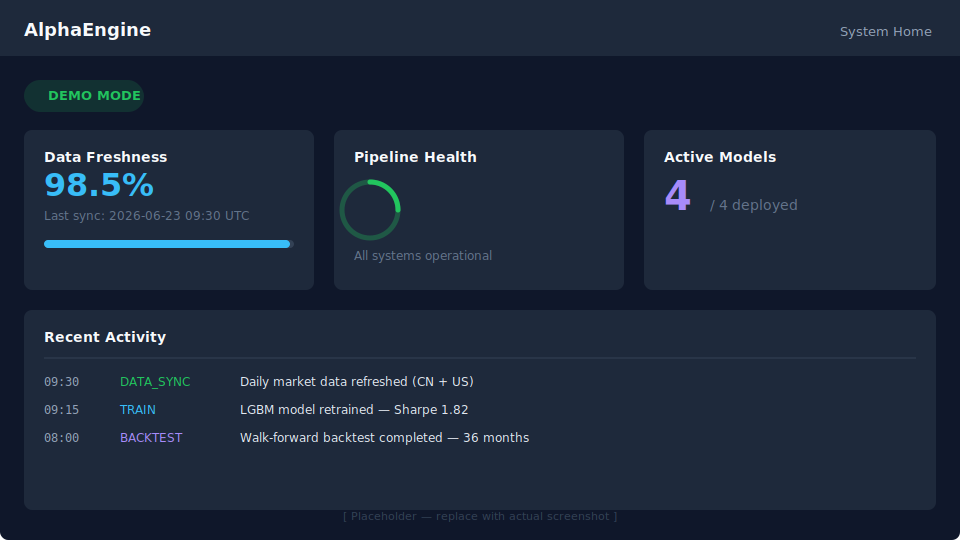
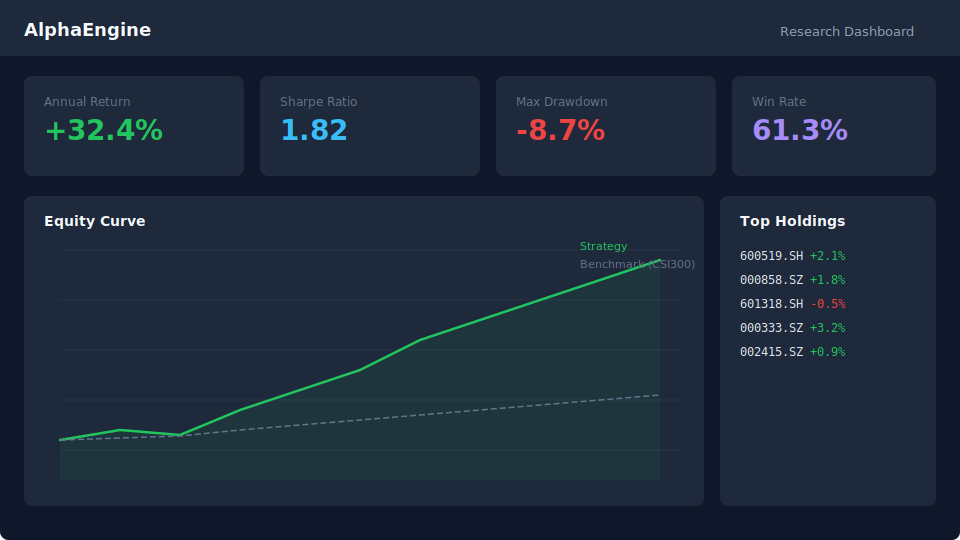
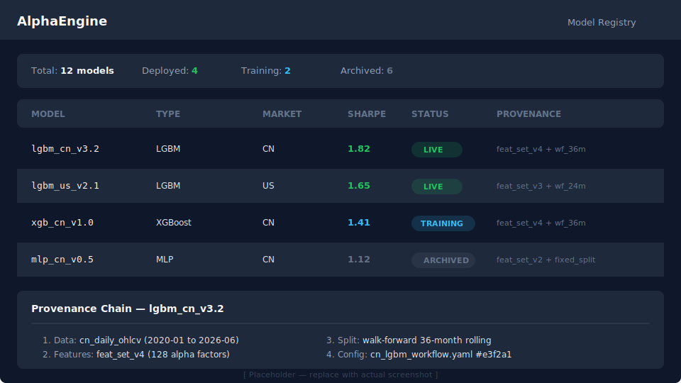

# AlphaEngine V2

## 极简、优雅、自包含的量化策略研究引擎

### 1. Quick Start: Demo Mode

最快体验 AlphaEngine 的方式是启动 Demo Mode，无需真实数据即可查看完整 Dashboard。

> **Note:** This project uses [Astral `uv`](https://astral.sh/uv/) for dependency management. `uv.lock` is the source of truth.

```bash
# 安装 Python 依赖
uv sync

# 安装前端依赖
cd qlib-dashboard && npm ci && cd ..

# 启动 Demo 模式
uv run python api_server.py --demo
```

打开 http://localhost:8000，任意用户名/密码登录即可。

**Demo Mode 详细说明：**

Demo Mode 会自动加载 contract fixtures（bundled sample dashboard data），让你无需配置数据源即可体验完整功能：

- Bundled contract fixtures / sample dashboard data for CN market.
- 预填充回测结果和 Equity Curve，Dashboard 图表即开即用。
- 所有 UI 页面（Home、Dashboard、Model Registry）均以真实数据样式展示。
- Demo Mode is intended for safe UI exploration and serves bundled sample data for the main onboarding/dashboard path.

> **Tip:** 如果页面左上角显示绿色 **DEMO MODE** 标签，说明已成功进入 Demo 模式。

**你应该看到：**
- ✅ **Demo Mode** 标签显示在页面顶部
- ✅ Dashboard 展示 Equity Curve 图表
- ✅ Holdings 标签页显示 SH600000 持仓
- ✅ Attribution 标签页显示归因数据

**Screenshots:**

**System Home** — Mode badge, data freshness, and pipeline health at a glance:



**Research Dashboard** — Key metrics (return, Sharpe, drawdown) and equity curve:



**Model Registry** — All trained models with status and provenance chain:



### 2. Local Deployment

#### Demo Mode (recommended for first-time users)

```bash
uv sync
cd qlib-dashboard && npm ci && cd ..
uv run python api_server.py --demo
```

Open http://localhost:8000 — any username/password works in demo mode.

#### Full Mode (with real data)

```bash
# Terminal 1: API server
uv run python api_server.py

# Terminal 2: Frontend dev server (hot reload)
cd qlib-dashboard && npm run dev
```

Open http://localhost:5173 (dev) or http://localhost:8000 (production).

#### Local Validation

```powershell
.\validate_all.ps1
```

Runs 11 quality gates: Ruff, Mypy, Pytest, TypeScript check, frontend lint, unit tests, build, Playwright E2E, and more.

### 3. 核心架构
- **单一运行时**: 所有 API 请求都通过 `api_server.py` 路由。
- **Agent 驱动**: 内置 Alpha, Risk, Governance, Developer 四大 Agent 协同工作。
- **Qlib 集成**: 底层基于微软 Qlib 量化框架，支持多种市场和特征包。
- **架构收敛交接**: Phase 1-6 重构规则与任务边界见 docs/architecture/phase_1_6_agent_handoff.md。
- **发布文档**: 安装、配置、运维、安全、性能、合同见 docs/release/index.md。
- **工作成果总结**: 见 docs/release/work_summary_20260620.md。

### 4. 任务管理 (Makefile)
使用 `Makefile` 快速执行常用任务：
- `make data`: 更新市场数据。
- `make train-us` / `make train-cn`: 训练模型。
- `make backtest`: 运行回测流水线。
- `make breakfast`: 生成每日晨报。

### 5. 容器化部署
推荐使用 Docker Compose 进行一键部署：
```bash
docker-compose up -d
```
API 服务将运行在 `8000` 端口，前端已集成在容器内由 FastAPI 直接挂载。

### 6. Environment Variables

| Variable | Default | Description |
|---|---|---|
| `ALPHA_ENGINE_ENV` | `development` | Runtime environment (`development`, `production`). |
| `API_PORT` / `PORT` | `8000` | API server listen port. |
| `API_HOST` | `0.0.0.0` | API server bind address. |
| `CORS_ORIGINS` / `ALLOWED_ORIGINS` | `localhost:5173,localhost:8000` | Comma-separated allowed CORS origins. |
| `TRADING_UI_USER` | *(none)* | Username for live mode authentication. |
| `TRADING_UI_PASSWORD` | *(none)* | Password for live mode authentication. |
| `TRADING_CONFIG_DIR` | `./configs` | Configuration files directory. |
| `TRADING_DATA_DIR` | `./data` | Market data storage directory. |
| `TRADING_REPORTS_DIR` | `./reports` | Generated reports directory. |
| `TRADING_ARTIFACTS_DIR` | `./artifacts` | Model artifacts directory. |
| `TRADING_STATIC_SITE_DIR` | `./qlib-dashboard/dist` | Static site build directory. |
| `QLIB_PROVIDER_URI` | *(auto)* | Qlib data provider URI. |
| `TZ` | `Asia/Shanghai` | Timezone for scheduling and logging timestamps. |

> **Note:** All environment variables are optional. Sensible defaults are provided; override only when needed.

### 7. Troubleshooting

**No data / empty data directory**
- Run `make data` to download market data. In demo mode, data is bundled — no download needed.
- Check that `TRADING_DATA_DIR` points to a writable directory.
- For CN market data, ensure your data source credentials are configured in `configs/`.

**Dashboard shows empty charts**
- Make sure the API server is running (`uv run python api_server.py`) and accessible at the configured port.
- If using demo mode, confirm you passed `--demo` when starting the server.
- Check browser console for CORS errors — in dev mode, the frontend (port 5173) proxies to the API (port 8000).

**Auth / permission errors**
- In demo mode, any username/password can be used. In live mode, configure `TRADING_UI_USER` and `TRADING_UI_PASSWORD`.
- On Linux, ensure the data and model directories have correct read/write permissions for the process user.

**Model training fails**
- Verify Qlib is installed and `QLIB_PROVIDER_URI` is set: `uv run python -c "import qlib; print(qlib.conf)"`
- Check available disk space — model artifacts and intermediate data can be large.
- Review logs in the `logs/` directory for error details.

**Port already in use**
- Change the port: `API_PORT=8001 uv run python api_server.py`
- Or kill the existing process: `lsof -i :8000` (Linux/macOS) / `netstat -ano | findstr :8000` (Windows).

---
*更多细节请参考 `agents/developer/DESIGN.md` 和 `scripts/README.md`。*
