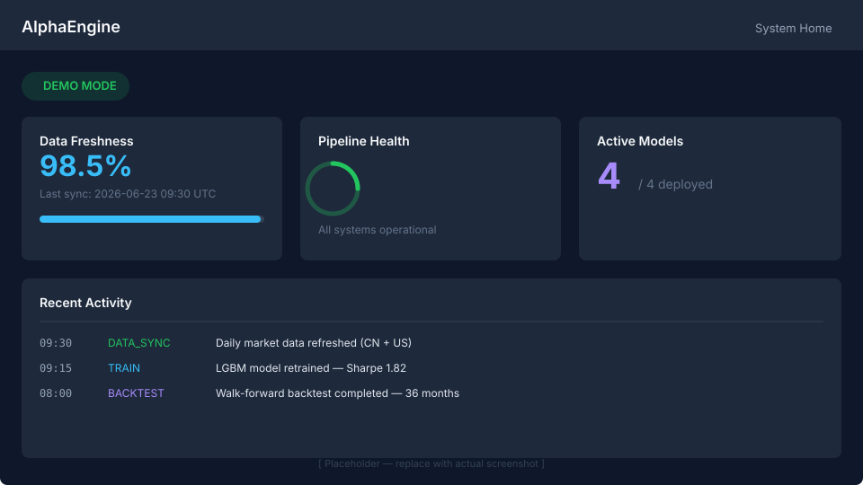
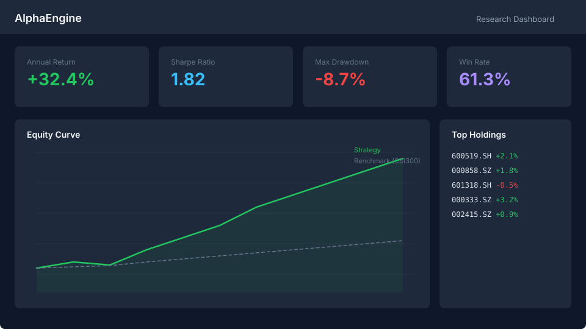
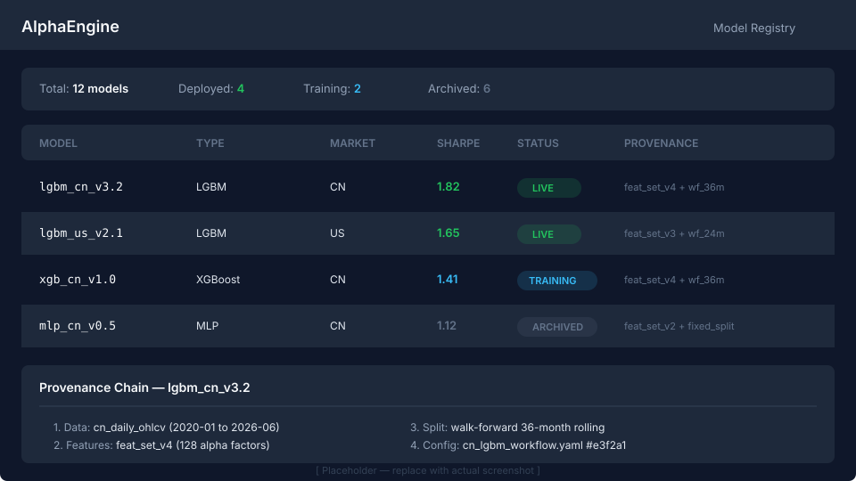

# AlphaEngine V2

## 证据驱动的量化策略研究引擎

AlphaEngine 用固定研究契约、时间有效的数据、walk-forward 验证和
fail-closed 决策，判断一个候选信号是否具有可信的基准相对收益。

> **Current status — 2026-07-29**
>
> - AlphaEngine 是研究专用系统，没有模型达到 `trade_ready`。
> - LightGBM 与 XGBoost 在静态人工股票池上的强超额，未能通过窗口起点
>   point-in-time Nasdaq-100 成分股检验。
> - 当前优先级是解释静态→PIT 的性能缺口、提高数据时间有效性，并寻找新的
>   经济信息集；暂不继续调树参数、技术指标窗口、Top-K 或组合权重。
> - 前端与交易执行不是当前阶段的主要问题。

核心结论见：

- [`docs/research/static_to_pit_alpha_diagnosis_2026-07-29.md`](docs/research/static_to_pit_alpha_diagnosis_2026-07-29.md)
- [`docs/research/lgbm_xgb_ranker_pit_robustness_2026-07-29.md`](docs/research/lgbm_xgb_ranker_pit_robustness_2026-07-29.md)
- [`docs/10d_universe_robustness_report.md`](docs/10d_universe_robustness_report.md)
- [`docs/methodology.md`](docs/methodology.md)

## 1. Quick Start: Demo Mode

The fastest way to inspect AlphaEngine is Demo Mode. It serves bundled contract
fixtures and does not require real market data.

> This project uses Astral `uv` for dependency management. `uv.lock` is the
> dependency source of truth.

```bash
uv sync
cd qlib-dashboard && npm ci && cd ..
uv run python api_server.py --demo
```

Open `http://localhost:8000`. Any username/password works in demo mode.

Demo Mode provides:

- bundled CN sample dashboard data;
- prefilled backtest metrics and equity curves;
- sample holdings and attribution output;
- safe UI exploration with no market-data update or trading behavior.

Screenshots:

**System Home**



**Research Dashboard**



**Model Registry**



## 2. Research contract

Both CN and US canonical research use a fixed 10-trading-day paradigm:

| Property | Contract |
| --- | --- |
| Forecast horizon | 10 trading sessions |
| Holding period | 10 trading sessions |
| Rebalance cadence | 10 trading sessions |
| Economic return | `Ref($close, -10) / $close - 1` |
| Training/evaluation boundary | processed rank labels for fitting; raw returns for economics |
| Validation | expanding half-year OOS windows with a 10-session embargo |
| Benchmark | CSI 300 for CN; QQQ for US |
| Scope | `research_only=true` |

Research execution is bound to versioned specs in
`configs/research_paradigms/`. Missing benchmark dates, universe hashes,
provider lineage, coverage evidence, or minimum windows fail closed.

## 3. Universe validity

Static curated universes remain useful for exploratory diagnostics, but they are
not unbiased historical opportunity sets.

The current US robustness path uses:

- official Nasdaq-100 membership at each OOS half-year start;
- the latest semiannual membership known on each training date;
- manifest-bound provider identity and membership hashes;
- explicit missing-symbol reporting rather than zero filling or current-member
  substitution.

This is window-start/semiannual point-in-time research, not full daily PIT.
China research still uses static curated membership and therefore remains
survivorship-biased.

## 4. Latest model-effectiveness finding

The fixed LightGBM/XGBoost comparison uses the same features, processed daily
rank target, 100-round budget, 10-session embargo, raw OOS returns, Top-15
portfolio, 20 bps cost, and QQQ benchmark.

| Candidate | Static curated relative excess | PIT NDX relative excess | PIT positive windows | PIT worst drawdown |
| --- | ---: | ---: | ---: | ---: |
| LightGBM LambdaRank | +65.04% | -20.49% | 1/4 | -26.11% |
| XGBoost `rank:ndcg` | +70.35% | -34.08% | 1/4 | -25.59% |

The algorithm-family difference is small compared with the universe-validity
problem. The next approved experiment is a frozen static-to-PIT attribution,
not another hyperparameter or factor-window search.

## 5. Core architecture

- **Single runtime**: `api_server.py` is the sole application entrypoint.
- **ResearchAssistant**: one research agent executes through `ResearchWorkflow`.
- **Spec-bound execution**: `SpecBoundResearchWorkflowExecutor` resolves and
  executes declared 10D research specs.
- **Evidence-gated decisions**: `PromotionDecision` is the canonical promotion
  interface and fails closed when required evidence is missing.
- **Research boundary**: no output authorizes live or automated trading.

## 6. Local deployment

### Demo mode

```bash
uv sync
cd qlib-dashboard && npm ci && cd ..
uv run python api_server.py --demo
```

### Full research mode

```bash
# Terminal 1
uv run python api_server.py

# Terminal 2
cd qlib-dashboard && npm run dev
```

Open `http://localhost:5173` for the development UI or `http://localhost:8000`
for the built application. “Full mode” means real research data; it does not
mean live trading.

### Validation

```powershell
.\validate_all.ps1
```

The validation script runs Python lint/type/tests, frontend checks/build, and
Playwright E2E gates.

## 7. Common tasks

```text
make data       update market data
make train-us   run the configured US training path
make train-cn   run the configured CN training path
make backtest   run the configured backtest path
make breakfast  generate the daily research brief
```

## 8. Container deployment

```bash
docker-compose up -d
```

The API listens on port `8000`; the built React UI is served through FastAPI.

## 9. Environment variables

| Variable | Default | Description |
| --- | --- | --- |
| `ALPHA_ENGINE_ENV` | `development` | Runtime environment |
| `API_PORT` / `PORT` | `8000` | API listen port |
| `API_HOST` | `0.0.0.0` | API bind address |
| `CORS_ORIGINS` / `ALLOWED_ORIGINS` | `localhost:5173,localhost:8000` | Allowed origins |
| `TRADING_UI_USER` | none | Full-mode UI username |
| `TRADING_UI_PASSWORD` | none | Full-mode UI password |
| `TRADING_CONFIG_DIR` | `./configs` | Configuration directory |
| `TRADING_DATA_DIR` | `./data` | Market-data directory |
| `TRADING_REPORTS_DIR` | `./reports` | Generated-report directory |
| `TRADING_ARTIFACTS_DIR` | `./artifacts` | Research-artifact directory |
| `TRADING_STATIC_SITE_DIR` | `./qlib-dashboard/dist` | Built frontend directory |
| `QLIB_PROVIDER_URI` | auto | Qlib provider path |
| `TZ` | `Asia/Shanghai` | Scheduling/log timezone |

## 10. Troubleshooting

**No data**

- Run `make data` for a real-data environment.
- Confirm `TRADING_DATA_DIR` is writable.
- Demo mode uses bundled fixtures and requires no download.

**Empty dashboard charts**

- Confirm the API server is reachable.
- Confirm `--demo` was supplied when using fixtures.
- Inspect browser CORS/network errors.

**Model training fails**

- Verify Qlib configuration:
  `uv run python -c "import qlib; print(qlib.conf)"`.
- Check disk space and logs.
- Verify provider and universe readiness before interpreting model output.

**Port already in use**

- Set `API_PORT=8001`, or terminate the process occupying port 8000.

More detail is available in `DESIGN.md`, `AGENTS.md`, `scripts/README.md`, and
`docs/release/index.md`.
